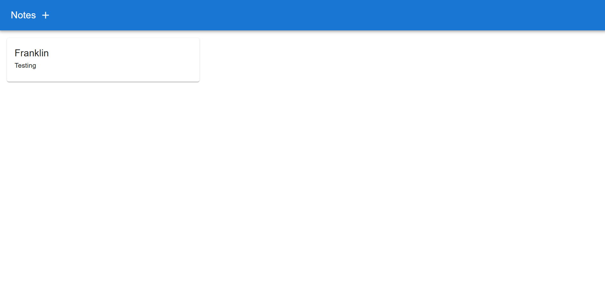
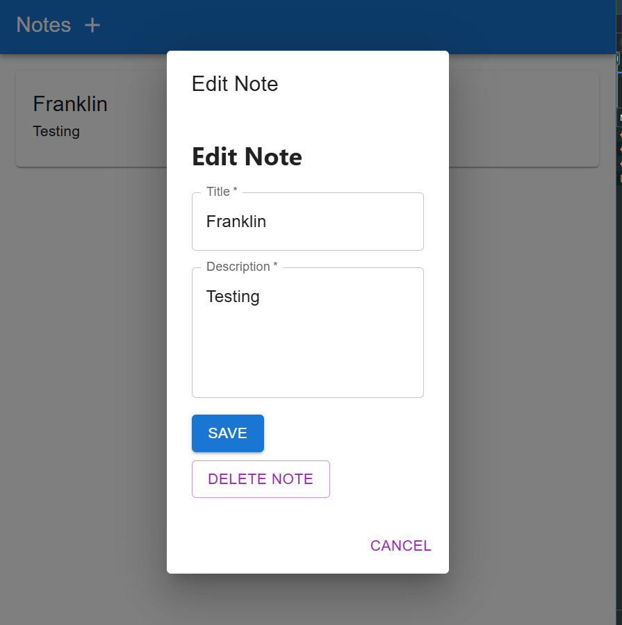
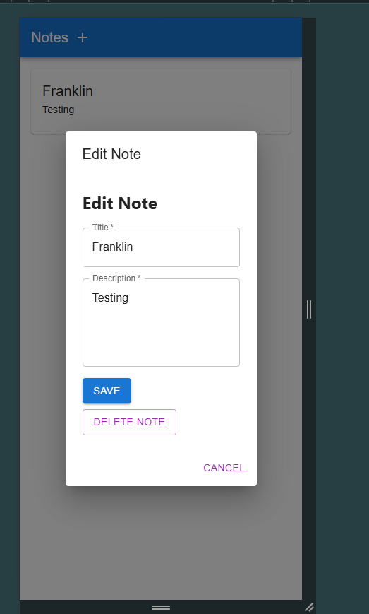

# **FS_I Application Documentation**

## **Description**

FS_I is a simple TypeScript-based web application built with React for the frontend and Node.js for the backend, following TypeScript formatting. The application is designed to allow users to **Add**, **Edit**, **View**, and **Delete** notes. It doesn't use a database, as no database was requested during the prescreening by Mr. McGee. 

This section will explain the setup, development, and deployment steps for both the frontend and backend.

Approximate Build time: 4 hours.

Documentation Time: 2 hours.

This is the Note List Page


This is the Create/Edit/Delete View in normal Responsive Size


This is the Create/Edit/Delete View when in iPhone 12 Pro


---

# **Startup of the Entire System**

### **Steps to Run the Application**

1. Clone the repository:
   ```bash
   git clone <your-repository-url>
   ```

2. Navigate to the project folder:
   ```bash
   cd FS_I
   ```

3. **Frontend Setup**:
   Follow the steps in the *Frontend Build and Deployment Scripts* section to set up and run the frontend.

4. **Backend Setup**:
   Follow the steps in the *Backend Build and Deployment Scripts* section to set up and run the backend.

---

# **Frontend Build and Deployment Scripts**

This section explains the scripts available in the `package.json` for the frontend React application. These scripts are designed to help with development, building for production, testing, and ejecting from the default React setup.

### **Scripts in `package.json`**

1. **`start`** - Start the development server
   ```bash
   npm run start
   ```
   This script runs the development server, which compiles the project and starts a local server. It watches for any file changes and reloads the page.

   - **How it works**: 
     - Uses `react-scripts start` to launch the app in development mode.
     - The development server is available at `http://localhost:3000`.

2. **`build`** - Create a production build
   ```bash
   npm run build
   ```
   This script creates an optimized, production-ready version of your React app.

   - **How it works**: 
     - Runs `react-scripts build`, which bundles and minifies the app, preparing it for deployment.
     - The output will be placed in the `build` directory.
     - The production build is optimized for performance, with minified JavaScript and CSS.

3. **`test`** - Run tests
   ```bash
   npm run test
   ```
   This script runs the tests for your application using Jest. By default, it runs tests in watch mode.

   - **How it works**: 
     - Uses `react-scripts test` to run Jest, the default testing framework.
     - It watches for file changes and automatically re-runs tests when changes are made.

4. **`eject`** - Eject the project
   ```bash
   npm run eject
   ```
   This script ejects your app from `react-scripts`, giving you full control over the build configuration (webpack, Babel, ESLint, etc.).

   - **How it works**: 
     - The `eject` command exposes all of the configuration files and build scripts so you can customize them.
     - **Note**: Ejecting is a one-way operation, so it is irreversible.

---

### **Development and Production Build Process**

1. **Development Mode (`npm run start`)**:
   - This mode is used during the development process to run the app locally, where you can make changes and see them in real-time without manually rebuilding the project.
   - Typically, you'll open `http://localhost:3000` in your browser.

2. **Production Mode (`npm run build`)**:
   - This mode is used when you're ready to deploy your app. It creates a production build, optimized for performance.
   - You can deploy the contents of the `build` folder to a hosting platform (e.g., GitHub Pages, Netlify, Vercel).

3. **Testing (`npm run test`)**:
   - This script runs Jest tests for your application, which is useful for ensuring that components and logic work as expected before shipping.

---

### **Setting up for Deployment**

1. **Production Build**:
   - To prepare your app for deployment, run:
     ```bash
     npm run build
     ```
   - This will generate a `build` folder containing the optimized application.

2. **Deployment**:
   - You can deploy the contents of the `build` folder to your hosting provider, such as:
     - **GitHub Pages**: Use `gh-pages` or a similar package.
     - **Netlify**: Drag and drop the `build` folder into the web interface or use continuous deployment.
     - **Vercel**: Deploy directly from GitHub using Vercel's GitHub integration.

---

# **Backend Build and Deployment Scripts**

This section explains the scripts used in the `package.json` for building and deploying your Node.js + TypeScript backend application. These scripts simplify the process of cleaning up old builds, compiling TypeScript files, and starting your application.

### **Scripts in `package.json`**

1. **`clean`** - Clean up old build files
   ```bash
   npm run clean
   ```
   This script deletes the `dist` directory (or any other folder you specify) where the compiled files are stored.

   - **How it works**: 
     - It runs `rimraf dist` to remove the `dist` folder.

   - **Requirements**:
     - Install `rimraf` as a development dependency using:
       ```bash
       npm install rimraf --save-dev
       ```

2. **`build`** - Compile TypeScript files
   ```bash
   npm run build
   ```
   This script compiles TypeScript files into JavaScript using the TypeScript Compiler (`tsc`). The generated files will be placed in the `dist` directory.

   - **How it works**:
     - It runs `tsc`, which compiles the `.ts` files into `.js` files.

3. **`start`** - Start the application
   ```bash
   npm run start
   ```
   This script starts the Node.js application from the compiled JavaScript files in the `dist` directory.

   - **How it works**:
     - Runs `node dist/server.js` (or equivalent entry file) to start the backend application.

4. **`deploy`** - Clean, build, and start the application
   ```bash
   npm run deploy
   ```
   This script combines `clean`, `build`, and `start` into one. It cleans old build files, recompiles the TypeScript files, and starts the Node.js application.

   - **How it works**:
     - Runs `npm run clean` to delete old builds.
     - Runs `npm run build` to compile the TypeScript files.
     - Runs `npm run start` to start the Node.js application.

5. **`test`** - Run tests for backend
   ```bash
   npm run test
   ```
   This script runs the Jest tests for your backend application, including any tests written for routes and server logic.

   - **How it works**:
     - Runs `jest --detectOpenHandles` to detect open handles and potential issues with asynchronous tasks or open server connections.

---

### **Summary of Commands**

| Script   | Command                     | Description                                      |
|----------|-----------------------------|--------------------------------------------------|
| `clean`  | `npm run clean`              | Deletes old build files in the `dist` directory. |
| `build`  | `npm run build`              | Compiles TypeScript files into JavaScript.      |
| `start`  | `npm run start`              | Starts the backend server from the compiled files. |
| `deploy` | `npm run deploy`             | Cleans, builds, and starts the backend server.  |
| `test`   | `npm run test`               | Runs Jest tests for the backend.                |

---

### **Notes**

- **`rimraf` Installation**:  
  If `rimraf` isn't installed, you can add it with:
  ```bash
  npm install rimraf --save-dev
  ```

- **TypeScript Configuration**:  
  Ensure you have a `tsconfig.json` file in your project to configure TypeScript.

  Example `tsconfig.json`:
  ```json
  {
    "compilerOptions": {
      "target": "ES6",
      "module": "commonjs",
      "outDir": "./dist",
      "rootDir": "./src",
      "strict": true
    },
    "include": ["src/**/*.ts"],
    "exclude": ["node_modules"]
  }
  ```

---

This documentation should provide a comprehensive and professional guide for understanding the build, deployment, and running processes of both the frontend and backend parts of the FS_I application.

